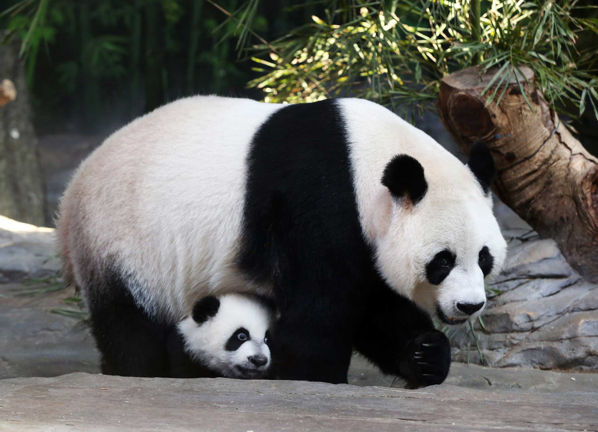

# Giant Panda Facts

The giant panda is one of the world's eight species of true bears.
Although for a number of decades there was some controversy over whether the panda was actually a bear at all, the recent consensus is that the panda is, in fact, all bear. 
Some scientists argued that the giant panda and the red panda which share many characteristics were both more closely related to raccoons than bears. Closer study of the giant pandas molecular structure, however, puts them in the family ursidae - the true bears.
Giant pandas live in the densely vegetated mountains of central China, where mist, heavy rains, and high humidity promote thick forests.
The panda dines almost exclusively on one type of plant material, bamboo, which makes up over 95% of its diet. On rare occasions pandas will consume other types of plants, small animals, or insects, but the bamboo diet is so dominant, and has been consumed by the panda for so many thousands of years, that it has evolved into a bamboo eating machine, and has even evolved special paws with bony "pseudo thumbs" for handling bamboo shoots.
The giant panda lives a solitary life and each individual marks, patrols and maintains its own territory. Giant pandas will actively avoid each other upon seeing or hearing another nearby, and females in particular will chase strangers out of their range and then actively and agitatedly re-mark the boundary lines with claw scratches, sprays of urine and strategic droppings.
Pandas will occasionally enter caves or hollowed out trees to sleep or den for a few days but do not have permanent living arrangements. They do not hibernate as some other bear species do, but they will make short migratory moves to warmer climates depending on the season.
Although not officially the national symbol of China, (the dragon is) the giant panda can be found on many Chinese coins and its likeness even appears on many of the nations official government documents.
# Giant Panda Reproduction
The giant panda reaches sexual maturity at 4 to 7 years. The female ovulates once a year and there is only a 2 to 3 day period during which she can conceive.
The pair will only remain together a matter of days. The pregnancy will last about 4 1/2 months. The newborn baby panda is a writhing, red, hairless creature the size of a cell phone bearing very little resemblance to its mother.
With the exception of kangaroos and some other marsupials, a brand new baby panda is the smallest new-born in relation to it's mother's body - only about 1/1000th of her size! It is extremely difficult for the mother without the benefit of a marsupials pouch, to protect the precious offspring, and though twins are often born, perhaps in anticipation of difficulties in the early months of life, it is very rare that both siblings survive.
The giant panda, like all bears, has a very slow reproductive rate, so the survival of the remaining cub is critical, and panda mothers are vigilant parents who will defend their cub with great ferocity and fearlessness. Close and cuddly, the young giant panda will stay with its mother for about 3 years before heading out on its own.

